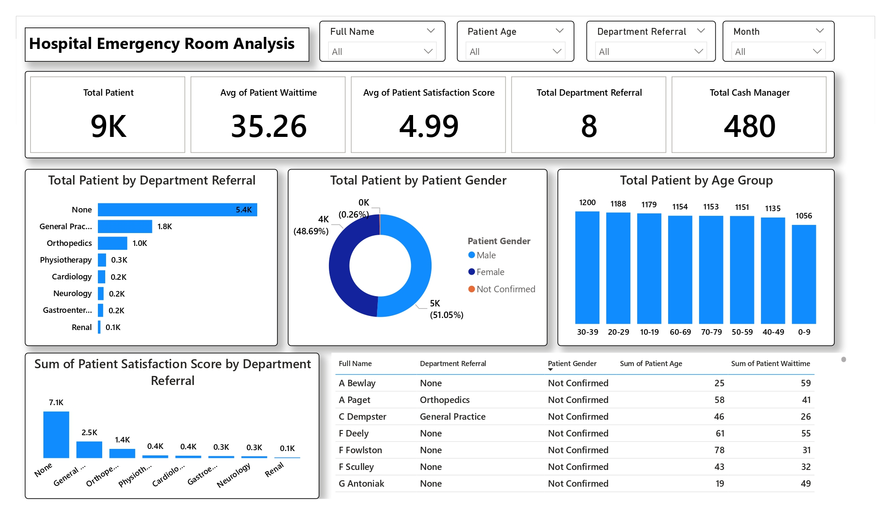

# 🏥 Hospital Emergency Room Analysis Dashboard

## 🧠 About the Dashboard
The **Hospital Emergency Room Analysis Dashboard** offers a comprehensive view of patient visits, department referrals, patient satisfaction, and wait times.  
It empowers hospital administrators and healthcare analysts to monitor operational performance, identify bottlenecks, and improve patient care quality.

**Overview**



---

## 📌 Project Overview
This Power BI dashboard visualizes emergency room (ER) activity—including total patient inflow, wait times, satisfaction trends, and department-wise performance—across different patient demographics and referral types.

### 💼 Business Problem

> **"How can a hospital improve patient satisfaction and reduce ER wait times by analyzing referral patterns, patient visit trends, and care quality metrics?"**

This dashboard solves key healthcare challenges by providing deep insights into ER operations and patient experience.  
It enables stakeholders to:

- 🔍 Detect **departments causing higher wait times**.
- 📈 Track **repeat visits** and **satisfaction improvements**.
- ✅ Monitor **age group trends** to better allocate resources.
- ⏱ Optimize **wait time** management and reduce bottlenecks.
- 🎯 Enhance **referral patterns** and department coordination.

---

## 🛠️ Tools & Technologies
- Power BI Desktop
- PostgreSQL (Database Queries)
- DAX (for measures and KPIs)
- SQL (Advanced analysis queries)

---

## 📈 Key Dashboard Features

1. **Overall ER Metrics**
   - Total Patients: **9,000**
   - Avg Patient Wait Time: **35.26 mins**
   - Avg Satisfaction Score: **4.99**
   - Total Department Referrals: **8**
   - Total Cash Managers: **480**

2. **Demographic & Departmental Breakdown**
   - Patients by **Age Group**
   - Patients by **Gender**
   - Patients by **Referral Department**
   - Sum of **Satisfaction Scores** by Department

3. **Operational Trends**
   - Monthly patient inflow
   - Avg wait time trends
   - Patient satisfaction improvements between repeat visits

---

## 💡 Deep Insights (Powered by SQL Queries)

Here are the **advanced queries** used to unlock deeper operational insights:


### 1. Patient Satisfaction Trend Between Visits

Tracks patients who had **exactly 2 visits** and compares if their satisfaction **improved or declined**.

```sql
WITH Ranked_Visits AS (
  SELECT 
    "Patient Last Name",
    "Patient Gender",
    "Patient Satisfaction Score",
    "Patient Admission Date",
    ROW_NUMBER() OVER (PARTITION BY "Patient Last Name" ORDER BY "Patient Admission Date") AS Visit_Rank,
    COUNT(*) OVER (PARTITION BY "Patient Last Name") AS Total_Visits
  FROM "Hospital_ER_Data"
  WHERE "Patient Satisfaction Score" IS NOT NULL
),
First_Second_Visit AS (
  SELECT 
    "Patient Last Name",
    "Patient Gender",
    MAX(CASE WHEN Visit_Rank = 1 THEN "Patient Satisfaction Score" END) AS First_Score,
    MAX(CASE WHEN Visit_Rank = 2 THEN "Patient Satisfaction Score" END) AS Second_Score
  FROM Ranked_Visits
  WHERE Total_Visits >= 2  -- Only those who have at least 2 visits
  GROUP BY "Patient Last Name", "Patient Gender"
)
SELECT 
  "Patient Last Name",
  "Patient Gender",
  First_Score,
  Second_Score,
  CASE 
    WHEN Second_Score > First_Score THEN 'Improved'
    WHEN Second_Score < First_Score THEN 'Declined'
    WHEN Second_Score = First_Score THEN 'No Change'
  END AS Score_Trend
FROM First_Second_Visit
WHERE First_Score IS NOT NULL AND Second_Score IS NOT NULL  -- Ensure both scores exist
ORDER BY "Patient Last Name"; 

